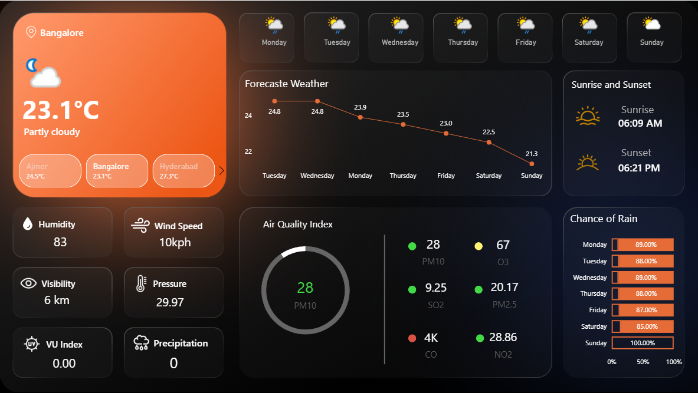

# Weather---Power-BI---Dashboard
“Interactive Weather Dashboard built in Power BI using API data.”

“From raw weather API data to clear insights — a Power BI dashboard that makes climate trends easy to understand.”

# 🌦️ Weather Power BI Dashboard  

> From raw weather API data to clear insights — an interactive dashboard built with Power BI to visualize temperature, humidity, and seasonal patterns.  

---

## 📌 Overview  
This project demonstrates how to connect live weather API data to **Power BI**, clean and transform it using **Power Query**, and build an interactive dashboard for weather trend analysis.  

---

## 🚀 Features  
- 🔗 API integration with weather data  
- 📊 Interactive dashboard with filters and slicers  
- 🌡️ Temperature and humidity trend analysis  
- 📅 Seasonal and time-based comparisons  
- 📈 KPIs for quick insights  

---

## 🛠️ Tools & Skills Used  
- **Power BI Desktop** – Dashboard development  
- **Power Query Editor** – Data transformation  
- **DAX** – Creating calculated measures  
- **Data Visualization** – Clear, user-friendly design  

---

## 📸 Dashboard Preview  

  

---

## 🎯 Learning Outcomes  
- Connected Power BI to a live API source  
- Gained experience in data cleaning and transformation  
- Practiced creating KPIs and measures with DAX  
- Designed an interactive visualization for real-world data  

---

## 📥 How to Use  
1. Clone this repository  
   ```bash
   git clone https://github.com/zeensights/Weather---Power-BI---Dashboard.git
